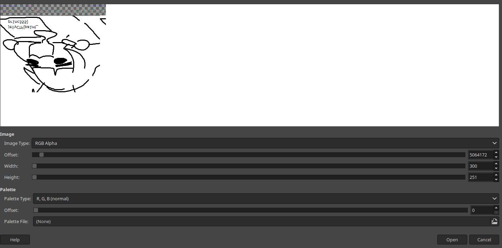

# part 1

python vol.py -f ~/vmware/ctf-win10/memory.dmp windows.hashdump.Hashdump

```
Volatility 3 Framework 2.7.0
Progress:  100.00               PDB scanning finished                                
User    rid     lmhash  nthash

Administrator   500     aad3b435b51404eeaad3b435b51404ee        31d6cfe0d16ae931b73c59d7e0c089c0
Guest   501     aad3b435b51404eeaad3b435b51404ee        31d6cfe0d16ae931b73c59d7e0c089c0
DefaultAccount  503     aad3b435b51404eeaad3b435b51404ee        31d6cfe0d16ae931b73c59d7e0c089c0
WDAGUtilityAccount      504     aad3b435b51404eeaad3b435b51404ee        9082e3468d0a84e876033173709cb118
jelly   1001    aad3b435b51404eeaad3b435b51404ee        aa05ab5319d59779b937bdbf9797d895
```

hashcat -m 1000 hash.txt /usr/share/dict/rockyou.txt

aa05ab5319d59779b937bdbf9797d895:jellynerd2

# part 2

python vol.py -f ~/vmware/ctf-win10/memory.dmp windows.pslist.PsList|grep -i paint
4700ress130000.0mspaint.exe     0xa307105550c0  9       -       1       False   2024-05-07 11:00:03.000000      N/A     Disabled

python vol.py -f ~/vmware/ctf-win10/memory.dmp windows.memmap.Memmap --pid 4700 --dump

mv pid.4700.dmp pid.4700.data

open with gimp, set size to 300x251, type to RGB Alpha, drag offset until it shows up (resize window for finer grained scrubbing), import, flip/mirror

